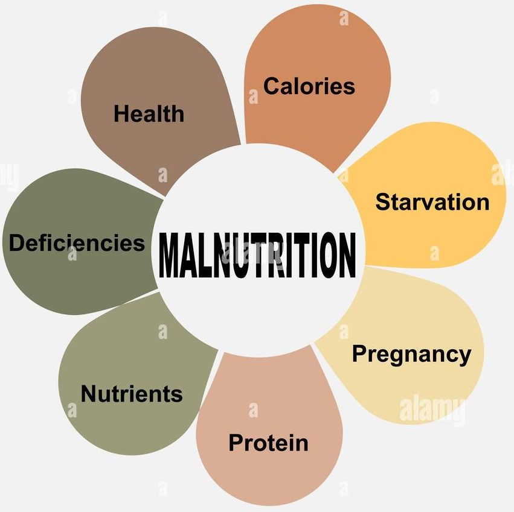

# Malnutrition Across The Globe

## How is Malnutrition affecting across the globe?
  1. How does the underweight percent change for different countries in different income classification levels?
  2. How does the overweight percent change for different countries in different income classification levels?
  3. What percent of children for the given countries below the age of 5 are under the low weight-to-height ratio as income classification decreases?
  4. How many countries fall under low food income deficit?
  5. How many countries fall under least developed countries?
  6. How many countries are landlocked developed or small island developing states?
  7. How does being overweight and underweight affect severe wasting in children under 5?

  These are some of the questions we are trying to answer

## Introduction To Data
- The datasets used for this study is available on Kaggle- (https://www.kaggle.com/datasets/ruchi798/malnutrition-across-the-globe)
- This data was collected by survey from year 1982-2019 in gap of every few years.
- There are 152 participating unique countries in this survey.
- There are 13 columns that we are taking into consideration for this study:
  - ISO code
  - Country
  - Survey year
  - Income classification
  - LDC
  - LIFD
  - LLDC or SIDS
  - Severe wasting
  - Wasting
  - Stunting
  - Overweight
  - Underweight
  - U5 Population('000s)
   
## Proccessing Of Data

  **Step 1**: Load all the neccesary Libraries to perform analysis efficeintly 
  **Step 2**: Loading all data in csv format in a Python jupyter file. 
  **Step 3**: Creating a new dataframe mal_countries of the columns that we are going to use. 
  **Step 4**: Replacing all null values in columns "Severe wasting","Wasting","Stunting","Overweight","Underweight","U5 Population('000s)" by their mean values. 
  **Step 5**: Converting the columns "LDC","LIFD","LLDC or SIDS" into a true Yes/No categorical columns instead of numerical. 
  **Step 6**: Converting "survey sample" column from object to string to fill the null values correctly and then again converting to numerical value**. 
  **Step 7**: Drop all duplicate columns. 
  **Step 8**: Cleaning the survey year column by only choosing the year before the special character and later converting the column to datetime. 
  **Step 9**: Changing income classification column from Data_CWA table to categorical column. 
  **Step 10**: Now these dataframes "Data_CWA"(Country wise average Data table) & "mal_countries"(The new dataframe created) are ready to perform analysis. 

## Drawing conclusions

  **Please refer to analysis notebook for code and Interactive visualizations - [Analysis Workbook](https://github.com/abagla18/Projects/blob/main/Malnutrition%20across%20the%20globe/Malnutrition_across_the_globe.ipynb)**

  ### To help us understand how the income classification affects the percent underweight of each country:
    - We group all the countries that fall into each income classification bucket and sort them first by income classification and then by underweight in ascending order.    
    - By plotting percent underweight against each country for each income classification we do see some outliers but if they are ignored we can easily conclude that lower the classification more percent of people are underweight.Here Niger being the highest underweight percent.
    - We also see that Bangladesh, India & Timor-leste are top 3 countries with highest percent of underweight although they do fall under the outlier category.
    - The KDE plot shows that under low income(0.0) & low income(1.0) has approximately 50% of underweight population while middle income(2.0) has around 45% of underweight population & upper income(3.0) has 15% underweight population as compared to others.

  ### To help us understand how the income classification affects the percent overweight of each country:
    -  We group all the countries that fall into each income classification bucket and sort them first by income classification and then by overweight in ascending order.
    - By plotting percent overweight against each country for each income classification we do see some outliers but if they are ignored we can easily conclude that higher the classification more percent of people are overweight in middle income(2.0) category than lower categories.Here Libya being the highest overweight percent.
    - We also see that Ukraine is with highest percent of overweight country although it does fall under the outlier category.

  ### Determine What percent children below the age of 5 are under the low weight-to-height ratio(Seveere wasting) for each country as income classification decreases.
    -  We group all the countries that fall into each income classification bucket and sort them first by income classification and then by severe wasting in ascending order.
    - By plotting severe wasting for each country according to its income classification we can clearly see that the lower income countries are more prone to severe wasting than the middle or high income countries.

  ### How many countires fall under Low income food deficit, least developed, Landlocked Developed Countries & small island developing states.
    - More than 75% of total countries fall under Low income food deficit.
    - more than 100 countries fall under least developed which can also lead us to conclude that almost all the countries that are least are also low income ffood deficit countries.
    - approximately 90% of the countries also fall in and Landlocked Developed Countries & small island developing states.

  ### When we counterplot "Sever wasting,overweight, & underweight" against each other in a pairplot we can conclude that these factors do affect each other extensively thus leaving the population of these countries malnourished.

  ### What percent of children Under-five mortality rate (per 1000 live births) actually fall under the underweight category.
    - We can reach to this analysis that the mortality rate increases as population of children under the age of 5 who are in the underweight category increases.

## Measures to eradicate Malnourishment across the globe:
    - We need to work towards gathering more data every year to analyze it more efficeintly
    - Reach out to high income countries to come forward and educate the low income countries on malnourishment and the changes they would be interested to bring in to fight hunger.
    - Get big companies to help these countries by organising food camps on regular basis.
    

# Creating awareness throught the world is very important before loss of more human life!
